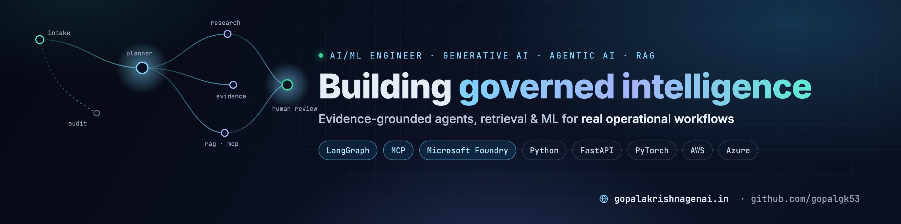

<!-- Header -->

  

  

  
  
  
  
  
   
  
  
  
  
  

---

## 🧭 Domain-grounded AI engineering

I'm an **AI/ML Engineer at SunRay Construction Solutions** in Hyderabad. Before I built AI for construction payment protection, I spent years doing the work myself, as a research analyst and then a data scientist. That work covered Notice to Owner research, lien and payment-rights deadlines, and reconciling what a customer claims against what the documents actually show.

That background shapes how I build. I know where ambiguity, missing evidence and compliance risk enter a workflow, so my systems are designed around them:

- **Evidence before answers.** Agents cite source records, keep what the customer said separate from what was verified, and never overwrite the original data.
- **Probabilistic AI, deterministic control.** Models produce structured findings. Plain application code decides what happens next, so model output never directly changes an operational state.
- **Escalate, don't guess.** When documents conflict, the system routes the case to a human with the discrepancy spelled out, rather than inventing a resolution.
- **Honest evaluation.** Labelled synthetic datasets, frozen versions, and mistakes corrected in the open rather than hidden.

  

## 🚀 Featured projects

| Project | What it is | Architecture highlights | Stack |
|---|---|---|---|
| [**construction-legal-ai-suite**](https://github.com/gopalgk53/construction-legal-ai-suite) | AI for construction payment protection: work-order intelligence, Notice to Owner research coaching and payment-risk prediction | Microsoft Foundry specialist agents · **MCP** retrieval tool on AWS Lambda · deterministic Python router · bounded correction loop · human review | Python · FastAPI · MCP · AWS · Azure · Docker · Next.js |
| [**portfolio**](https://github.com/gopalgk53/portfolio) | Source for [gopalakrishnagenai.in](https://www.gopalakrishnagenai.in): case studies, verified credentials and an integrated AI assistant | Streaming AI assistant grounded in portfolio content · server-side API routes · SEO metadata and JSON-LD | Next.js · TypeScript · Tailwind · Vercel |
| [**FrontierWeekHack**](https://github.com/gopalgk53/FrontierWeekHack) | My working copy of the Microsoft Foundry Frontier Week hackathon labs | Building, tracing, evaluating and deploying agentic workflows on Microsoft Foundry | Microsoft Foundry · Python · Azure |

## 📈 Results from the suite

Measured on the **synthetic** evaluation sets published in the repositories:

- **154 / 156 (≈99%)** on the work-order intake-agent evaluation, with **100%** tool selection, tool-call success and tool-call accuracy
- **120 work orders across 24 scenario families** in the labelled evaluation corpus (versioned; the earlier version is frozen)
- **75 automated tests** passing on the multi-agent control plane: router, parser, correction overlay, observability and API
- **0.684 holdout ROC-AUC** for the best AutoML challenger on payment-risk prediction, benchmarked against an interpretable Logistic Regression production model
- **Two live Azure deployments** (work-order operations console and NTO research coach), shipped through GitHub Actions with OIDC

<!--
Operational impact (fill in with approved figures from SunRay before publishing):
- [X%] reduction in manual research time per work order
- [Y%] of discrepancies caught before notice preparation
- [Z] work orders processed per week through the AI-assisted workflow
-->

## 🧰 Toolbox

- **AI and ML:** Python · PyTorch · scikit-learn · LangChain · LangGraph · RAG · vector databases · SHAP · DataRobot
- **Agents:** Microsoft Foundry · Model Context Protocol · multi-agent orchestration · evaluation and tracing
- **Engineering:** FastAPI · Pydantic · Next.js · TypeScript · PostgreSQL · Docker
- **Cloud and MLOps:** AWS (S3, Glue, Athena, SageMaker, Lambda, API Gateway) · Azure (Container Apps, App Service, ACR) · GitHub Actions

## 🎓 Credentials

- **Post Graduate Program in AI and Machine Learning**: McCombs School of Business, The University of Texas at Austin (2021)
- **Founderz Agent Explorer and Agent Architect** (2026)
- **IBM Generative AI specializations** for data scientists and data analysts, plus MLOps and Practical Data Science specializations from DeepLearning.AI
- [See all credentials →](https://www.gopalakrishnagenai.in)

## 📫 Connect

  
  
  

Open to Generative AI Engineering, Agentic AI and ML Engineering roles.

  

